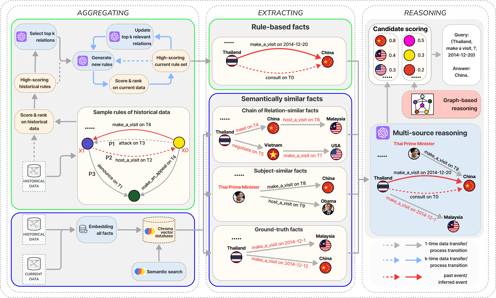

# MSKGen: Query-Aware Temporal Knowledge Graph Reasoning with Multi-Source Knowledge Based Generation

This is the official repository for the paper "Query-Aware Temporal Knowledge Graph Reasoning with Multi-Source Knowledge Based Generation," which has been accepted and will be published in the **Lecture Notes in Artificial Intelligence** series by **Springer** at the [**ICCCI 2025** conference](https://iccci.pwr.edu.pl/2025/). It is published in the prestigious Springer series [Lecture Notes in Artificial Intelligence (LNAI)](https://link.springer.com/chapter/10.1007/978-3-032-09321-9_6). 

We have attached the official acceptance notification below as proof: [Paper Acceptance Notification](iccci2025.pdf)

For a detailed explanation of our methodology, experiments, and results, please refer to our full paper: [Query-Aware Temporal Knowledge Graph Reasoning with Multi-Source Knowledge Based Generation](paper.pdf).

## 💡 Introduction

MSKGen (Multi-Source Knowledge-Based Generation) is a novel query-aware approach for Temporal Knowledge Graph Reasoning (TKGR) that integrates multiple knowledge sources to generate accurate predictions. Recent TKGR approaches leveraging Large Language Models (LLMs) often face significant limitations, such as relying solely on first-order historical information, struggling with heavy information loads, and underutilizing LLMs' potential for reasoning with semantically similar information.

To address these issues, MSKGen integrates rule-based facts with semantically retrieved facts. This approach maintains interpretability while maximizing the semantic capabilities of LLMs, addressing the information load challenges faced by current LLM implementations.

## 🖼️ Model Architecture

The architecture of MSKGen is divided into three main stages: **Retrieving**, **Multi-Source Reasoning**, and **Scoring**.

## 🚀 Experimental Results

We evaluated MSKGen on three common benchmark datasets: **ICEWS14**, **GDELT**, and **YAGO**. The experimental results demonstrate that MSKGen achieves superior performance over state-of-the-art methods, including graph-based, rule-based, and other LLM-based models.

### Main Results

The table below compares MSKGen with other methods based on **Hit@N** metrics:

| Method | Model | ICEWS14 Hit@1/3/10 | GDELT Hit@1/3/10 | YAGO Hit@1/3/10 |
| :--- | :--- | :---: | :---: | :---: |
| Graph-based | RE-NET | 0.582/0.440/0.313 | 0.261/0.081/0.171 | 0.629/0.607/0.729 |
| | RE-GCN  | 0.301/0.613/0.470 | 0.158/0.084/0.299 | 0.404/0.468/0.629 |
| | TiRGN | 0.338/0.497/0.650 | 0.136/0.233/0.376 | 0.843/0.913/0.929 |
| | HGLS | 0.490/0.704/0.350 | 0.118/0.217/0.332 | 0.806/0.901/0.919 |
| Rule-based | TLogic | 0.326/0.612/0.483 | 0.113/0.212/0.351 | 0.740/0.789/0.791 |
| LLM-based | GPT-Neox-ICL | 0.295/0.406/0.475 | 0.068/0.211/0.120 | 0.720/0.846/0.810 |
| | TiRGN-CoH | 0.330/0.496/0.649 | 0.083/0.212/0.332 | 0.792/0.830/0.843 |
| | GenTKG | 0.528/0.473/0.363 | 0.134/0.220/0.300 | 0.792/0.830/0.843 |
| | **MSKGen (TiRGN)** | **0.384**/**0.525**/**0.710** | **0.145**/**0.235**/**0.402** | **0.856**/**0.929**/**0.947** |

**MSKGen (TiRGN)** achieves state-of-the-art performance across all three datasets and all metrics.

### Ablation Study

We conducted ablation studies on the ICEWS14 dataset to evaluate the contribution of each component.

| Model | Hit@1 | Hit@3 | Hit@10 |
| :--- | :---: | :---: | :---: |
| MSKGen w/o rule-based facts | 0.350 | 0.520 | 0.630 |
| GPT-NeoX-ICL | 0.295 | 0.406 | 0.475 |
| TiRGN-CoH | 0.330 | 0.496 | 0.649 |

MSKGen without rule-based facts outperforms previous LLM-based models, highlighting the effectiveness of retrieving diverse semantic facts via the RAG concept.

| Model | Hit@1 | Hit@3 | Hit@10 |
| :--- | :---: | :---: | :---: |
| MSKGen w/o semantic facts | 0.340 | 0.490 | 0.650 |
| TLogic | 0.326 | 0.612 | 0.483 |

MSKGen without semantic facts completely outperforms TLogic, indicating that the constructed rules are of higher quality and more diverse due to the LLM's semantic layer, which TLogic lacks.

## 🛠️ Setup and Usage Guide

- How to setup the environment: [installation](installation.txt)
- How to run the model: [user guide](user_guide.txt)
## ✉️ Contact
If you have any questions, please feel free to contact the authors:
- Nhan Khanh Nguyen: nknhan21@clc.fitus.edu.vn
- Thang Nam Doan: dnthang21@clc.fitus.edu.vn
- Thanh Le: lnthanh@fit.hcmus.edu.vn
